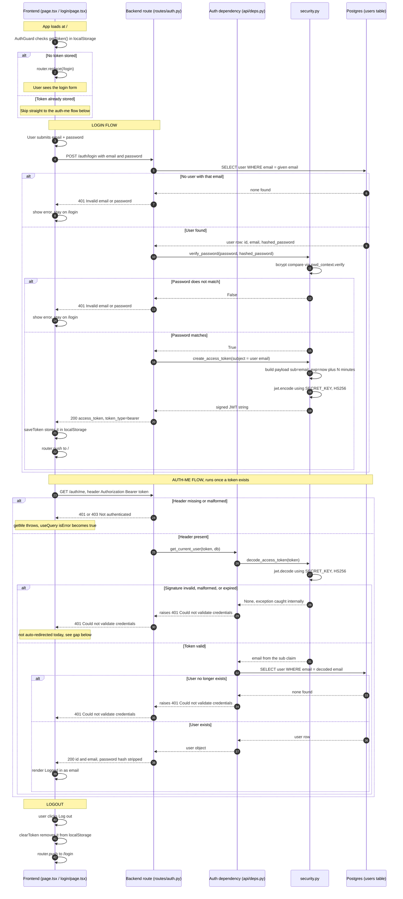

# Auth Flow — Full Trace, All Scenarios

Everything that happens from the moment the app loads to a fully logged-in (or rejected) request, across every file involved: `page.tsx` / `login/page.tsx` (frontend) → `routes/auth.py` → `api/deps.py` → `core/security.py` → Postgres. Every `alt/else` branch below is a real fork that exists in the code, not a hypothetical.

## Diagram

## Scenario reference

### Page load
| Scenario | Where it's decided | Outcome |
|---|---|---|
| No token in `localStorage` | `AuthGuard` (`app/auth-guard.tsx`), `getToken()` returns `null` | Redirected to `/login` |
| Token present | Same check passes | Renders `HomeContent`, proceeds to the auth-me flow |

### `POST /auth/login`
| Scenario | Where it's decided | Outcome |
|---|---|---|
| No user with that email | `login()` in `routes/auth.py`, `db.query(User).filter(...).first()` returns `None` | `401 "Invalid email or password"` — deliberately the same message as a wrong password, so the API never reveals whether an email is registered |
| User found, password wrong | `verify_password()` in `security.py` returns `False` (bcrypt comparison) | `401 "Invalid email or password"` |
| User found, password correct | `verify_password()` returns `True` → `create_access_token()` builds `{sub: email, exp: now+N}` and signs it with `SECRET_KEY` | `200` with `access_token` + `token_type` |

### `GET /auth/me` (or any route depending on `get_current_user`)
| Scenario | Where it's decided | Outcome |
|---|---|---|
| No `Authorization` header at all | The security scheme itself, before `get_current_user` even runs | `401`/`403 Not authenticated` |
| Header present, token signature invalid/tampered, or expired | `decode_access_token()` — `jwt.decode()` raises internally, caught, returns `None` | `401 "Could not validate credentials"` |
| Token valid, but that user was deleted since the token was issued | `get_current_user()`'s DB lookup returns `None` | `401 "Could not validate credentials"` |
| Token valid, user exists | Full success path | `200` with `UserOut` (`id`, `email` — `hashed_password` is stripped by the response model, never sent) |

### Logout
| Scenario | Where it's decided | Outcome |
|---|---|---|
| User clicks "Log out" | `handleLogout()` in `app/page.tsx` | `clearToken()` wipes `localStorage`, redirect to `/login` — purely client-side, the backend never "knows" a logout happened (stateless JWTs can't be revoked early — see the note on this in our earlier discussion about cookies/refresh tokens) |

## Known gap (not yet handled)

If your token expires **while you're already on the page** (rather than on page load), `/auth/me` correctly returns `401`, but nothing in the frontend currently catches that and redirects you — `useQuery`'s `isError` just flips to `true` and the UI silently fails to show your email. This is a real, currently-unhandled scenario, not a mistake in the diagram. A future fix would be a shared error handler (e.g. a `QueryCache` `onError` in the TanStack Query client, or a small fetch wrapper) that clears the token and redirects to `/login` whenever any request comes back `401`. Not built yet — flagging it here since you asked for every real scenario, including the ones the current code doesn't gracefully handle.
