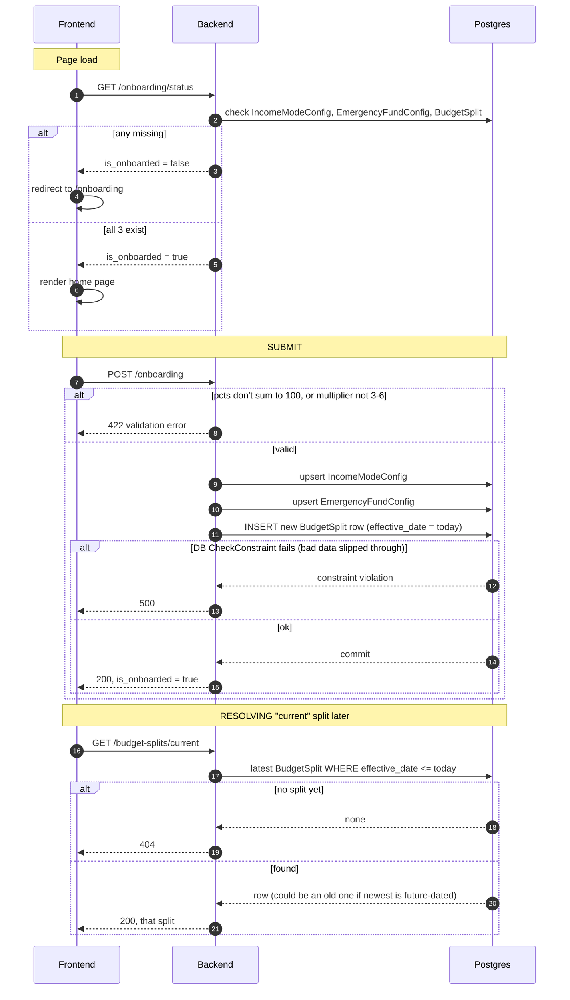
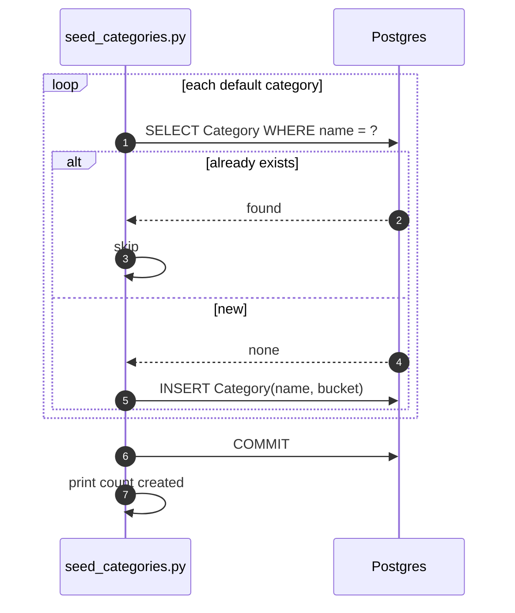

# Phase 2 — Flow Diagrams

## Onboarding (page load + submit)

## `seed_categories.py`

## Scenario reference

| Scenario | Result |
|---|---|
| Config incomplete on page load | Redirect to `/onboarding` |
| Percentages ≠ 100 or multiplier outside 3-6 | `422`, nothing written |
| First submit | 3 inserts |
| Re-submit | mode/EF **updated**, new `BudgetSplit` row **added** |
| Query split for a past date, split changed since | Returns the row that was active *then*, not today's |
| No split exists yet | `/budget-splits/current` → `404` |
| Re-running seed script | Existing categories skipped, only new ones inserted |
